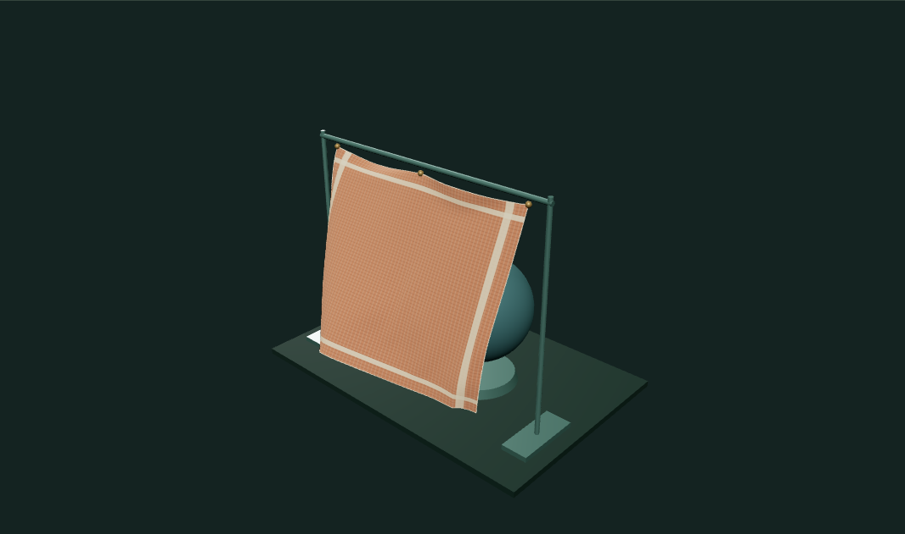
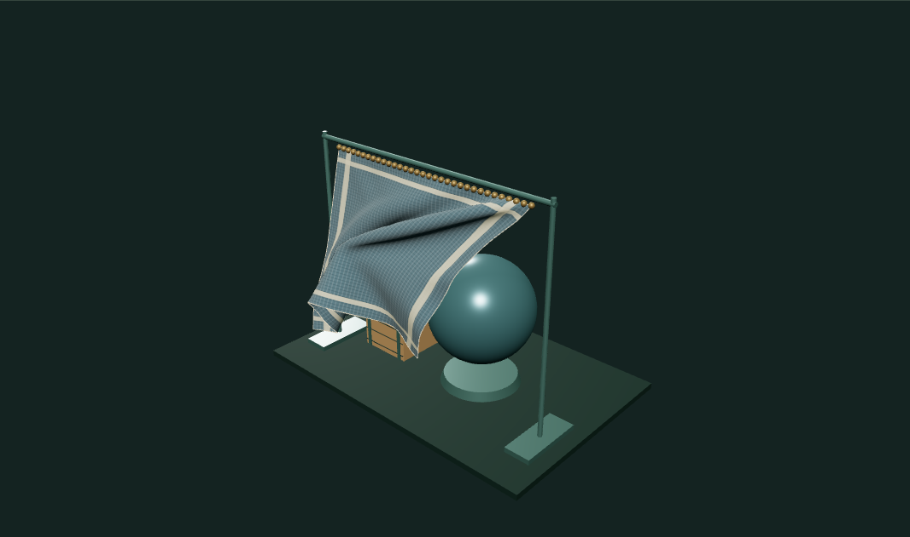

# Cloth Workbench

An interactive woven sheet with editable attachments, pointer grabs, material compliance and solid collision objects. The mesh evolves through extended position-based dynamics; the drape is computed locally rather than played from a canned animation.

## Run

The standalone app uses the shared `GraphicsWorkbench` runtime. Keep that checkout beside this repository for the local file dependency, then run:

```sh
npm install
npm run dev
npm test
npm run build
```

Both portfolio and standalone views use the same `src/index.js` implementation. No GitHub Actions are included.

## Try it

- Drag the cloth to grab one of its vertices. Empty-space dragging orbits the camera. A fast grab is clipped against the sphere and crate, so its target cannot jump through those objects.
- Compare Silk, Linen and Canvas. They change structural, shear and bending compliance, damping and mass; they also use different procedural woven materials.
- Set wind and gravity, pause, step one frame, or reset the surface. The scene starts from 80 computed settling frames. Reduced-motion mode keeps it paused until you play it.
- Choose corner, three-point, full-top-edge or free-fall attachments. **Edit pins** toggles attachments directly on the surface. Row and column controls select a vertex for keyboard operation. Undo restores the previous pin positions and set.
- Inspect the collision objects or cloth in wireframe. Freeze and export the current simulated mesh as OBJ, or use the runtime’s PNG capture.

## Solver

`src/simulation.js` exports `ClothSimulation`. The default 32 × 26-cell grid has 891 particles and 1,664 triangles. Structural neighbors resist stretch, diagonals resist shear, and two-hop distance constraints approximate bending. Each substep accumulates XPBD multipliers across seven solver passes with compliance scaled by timestep squared.

The fixed timestep is 1/120 second, bounded to four substeps per display frame. Velocity comes from position history, with gravity and a spatially varying wind force. Sphere, axis-aligned box and floor constraints project free particles out of solid geometry; contact reduces tangential motion. Grab motion additionally checks the swept segment against the sphere and box. Pins have zero inverse mass.

The compliance update follows [Macklin, Müller & Chentanez, XPBD (2016)](https://matthias-research.github.io/pages/publications/XPBD.pdf). The cloth uses distance-based bending rather than the paper’s full range of possible elastic constraints.

## Limits and tests

This is a bounded particle-surface simulation, not a garment CAD or production cloth engine. It has no self-collision, tearing, sewing, aerodynamic triangle forces or continuous triangle collision detection. Very tight folds can show triangle-level intersections even when particle contacts are satisfied. The visible stand supports the attachment markers but is not a collision shape.

Tests cover finite sustained motion, fixed pins, structural strain, material differences, sphere/box/floor projection, swept grab contact, inverse-mass restoration, timestep bounds and OBJ topology. Exports contain simulated vertices and faces; source textures are generated by Canvas drawing instructions.

## Run and explore

[Open the portfolio demo](https://zachsm.com/experiments/cloth-workbench). This repository runs independently and exports the same implementation used by the portfolio.

Requires Node.js 22 or later.

```sh
npm ci
npm test
npm run dev
```

`npm run build` produces a static site in `dist`. Editing, uploaded files, and exports stay in the browser. No account, server processing, or GitHub Actions is required.

## Captured examples



Silk · three attachments · wind strength 3.4.



Canvas · full top edge pinned · surface pulled sideways.

Exact reproduction steps are recorded in [the example manifest](examples/manifest.json).
